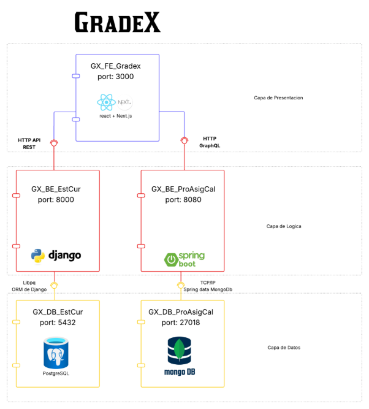


# **Artifact- Prototype 1**
1. **Team** 
- name: 2F  
- Integrantes: 
- David Stiven Martinez Triana 
- Carlos Sebastian Gomez Fernandez 
- Daniel Fernando Mateus Vega 
- Nestor Steven Piraquive Garzon 
- Luis Alfonso Pedraos Suarez 
- Cesar Fabian Rincon Robayo 
2. **Software System** 
- name: Gradex 
- Logo: 

  

- Description: Sistema de Gestión de calificaciones para colegios.
3. **Architectural Structures** 
- Component-and Connector (C&C) Structure: 
- C&C View:



- Description of architectural styles used: 
- **Estilo Arquitectónico Cliente-Servidor** El sistema presenta una separación clara entre el cliente (frontend) y los servidores (backends): 
- Cliente: GX\_FE\_Gradex (React + Next.js en el puerto 3000). Ubicado en la Capa de Presentación. 
  - Consume APIs expuestas por los servicios del backend usando HTTP REST y GraphQL. 
- Servidor: GX\_BE\_EstCur y GX\_BE\_ProAsigCal.Ubicados en la Capa de Lógica, se encargan del procesamiento de datos y lógica de negocio. 

Existe una comunicación unidireccional clara donde el cliente realiza peticiones HTTP a los servidores, y estos responden con los datos procesados. 

- **Microservicios:** 
- Servicios independientes: GX\_BE\_EstCur y GX\_BE\_ProAsigCal son dos servicios backend autónomos: 
- Usan frameworks diferentes (Django y Spring Boot). 
- Están desplegados en puertos distintos (8000 y 8080). 
- Manejan bases de datos separadas (PostgreSQL y MongoDB respectivamente). 
- Se comunican externamente con el frontend mediante HTTP (REST o GraphQL), y no hay acoplamiento directo entre ellos. 
- Description of architectural elements and relations: 

  **Descripción de Componentes:** 

  **GX\_FE\_Gradex** es el componente frontal del sistema, desarrollado con React y Next.js, y opera en el puerto 3000. Este módulo se encarga de la interfaz de usuario, proporcionando una experiencia interactiva y dinámica para estudiantes, profesores y administradores. Utiliza APIs REST y GraphQL para comunicarse con los componentes backend, asegurando una presentación fluida y eficiente de los datos. 

  **GX\_BE\_EstCur**, construido con Django y disponible en el puerto 8000, gestiona la lógica relacionada con estudiantes y cursos. Este backend procesa solicitudes como inscripciones, consultas de horarios y gestión de perfiles, almacenando y recuperando información de la base de datos PostgreSQL. Su diseño robusto garantiza un manejo eficaz de las operaciones académicas. 

  **GX\_BE\_ProAsigCal**, desarrollado con Spring Boot y expuesto en el puerto 8080, se enfoca en la lógica de profesores, asignaturas y calificaciones. Este componente maneja procesos como la asignación de materias, registro de notas y generación de reportes, utilizando MongoDB para almacenar datos no estructurados. Su arquitectura flexible permite adaptarse a las necesidades cambiantes del entorno educativo. 

  **GX\_DB\_EstCur** es una base de datos PostgreSQL que opera en el puerto 5432. Almacena información estructurada de estudiantes y cursos, como datos personales, historiales académicos y detalles de asignaturas. Su esquema relacional asegura integridad y consistencia en los datos, facilitando consultas complejas y transacciones seguras. 

  **GX\_DB\_ProAsigCal**, una base de datos MongoDB en el puerto 27018, guarda información flexible relacionada con profesores, asignaturas y calificaciones. Su naturaleza no relacional permite almacenar datos variados, como rúbricas de evaluación o comentarios de profesores ofreciendo escalabilidad y rapidez en el acceso a la información. 

  **Descripción de Conectores:** 

  **GX\_BE\_EstCur (Django) ↔ GX\_DB\_EstCur (PostgreSQL)** utiliza el ORM de Django junto con el driver libpq para establecer una conexión robusta con la base de datos PostgreSQL. Este conector permite mapear objetos de Python a tablas relacionales en PostgreSQL, simplificando operaciones como consultas, inserciones y actualizaciones. Este enfoque asegura que la lógica relacionada con estudiantes y cursos se maneje con integridad y consistencia en los datos. 

  **GX\_BE\_ProAsigCal (Spring Boot) ↔ GX\_DB\_ProAsigCal (MongoDB)** emplea Spring Data MongoDB sobre el protocolo TCP/IP para interactuar con la base de datos MongoDB. Este conector aprovecha el driver oficial de MongoDB para Java, permitiendo operaciones flexibles con datos no estructurados, como documentos JSON. La configuración incluye detalles como el puerto personalizado (27018). Este mecanismo es ideal para gestionar información dinámica de profesores, asignaturas y calificaciones, aprovechando la escalabilidad de MongoDB. 

  **HTTP API REST** permite al frontend interactuar con los backends mediante solicitudes estándar como GET, POST, PUT y DELETE, utilizando JSON como formato principal para el intercambio de información. Este conector es ideal para operaciones estructuradas, como consultar listas de estudiantes o registrar nuevas calificaciones. 

  **HTTP GraphQL** ofrece mayor flexibilidad, permitiendo al frontend enviar consultas personalizadas para obtener solo los datos necesarios, evitando así la sobrecarga de información. GraphQL es especialmente útil en interfaces complejas donde se requieren datos combinados de múltiples fuentes, como mostrar simultáneamente información de estudiantes y sus cursos. 

4. **Prototype** 
- Instructions for deploying the software system locally:

# GRADEX Prototipo 1

## Repositorio del proyecto

Para utilizar el proyecto simplemente clona el repositorio principal, el cual ya incluye todos los submódulos necesarios:

```bash
git clone --recursive https://github.com/Swarch2F/prototipo1.git
cd prototipo1
```

## Información sobre submódulos (Solo informativo)

Los submódulos fueron agregados inicialmente con estos comandos, pero no necesitas ejecutarlos nuevamente:

```bash
git submodule add https://github.com/Swarch2F/component-1.git components/component-1
git submodule add https://github.com/Swarch2F/component-2.git components/component-2
git submodule add https://github.com/Swarch2F/component-3.git components/component-3
```

## Actualización de submódulos recursivamente (por primer vez una vez clonado el proyecto):

```bash
git submodule update --init --recursive
git submodule update --remote --merge --recursive
```


## Levantar el prototipo con Docker Compose

El proyecto utiliza Docker Compose para gestionar la ejecución de todos los servicios.

### Archivo `docker-compose.yml`


### Ejecución rápida

Una vez clonado el proyecto, ejecuta:

```bash
docker compose up --build
```

## Acceso a servicios

Puedes acceder a cada servicio desde tu navegador en las siguientes rutas:

* **API REST (gx\_be\_estcur):** `http://localhost:8000/`
* **API GraphQL (gx\_be\_proasigcal):** `http://localhost:8080/graphiql`
* **Aplicación Frontend (gx\_fe\_gradex):** `http://localhost:3000/`

Para verificar el estado de los contenedores utiliza:

```bash
docker ps
```

Para pausar un contenedor utiliza el siguiente comando:
```bash
docker compose stop <nombre del contenedor>
```
Para volver a ejecutar un contenedor pausado utiliza el siguiente comando:
```bash
docker compose start <nombre del contenedor>
```
---
**© 2025 Swarch2F. GRADEX Prototipo 1**